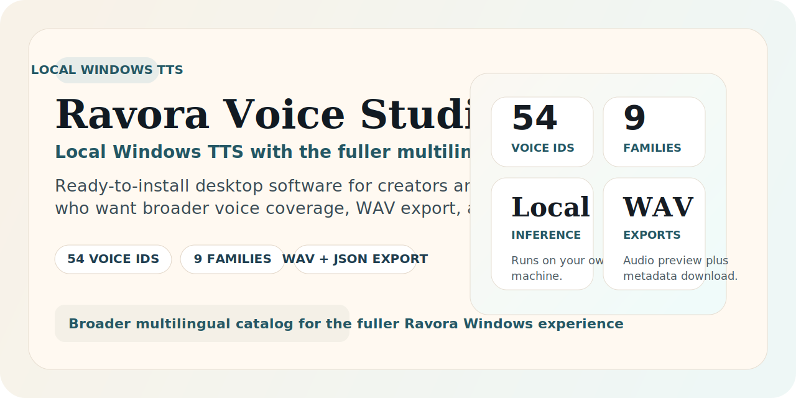
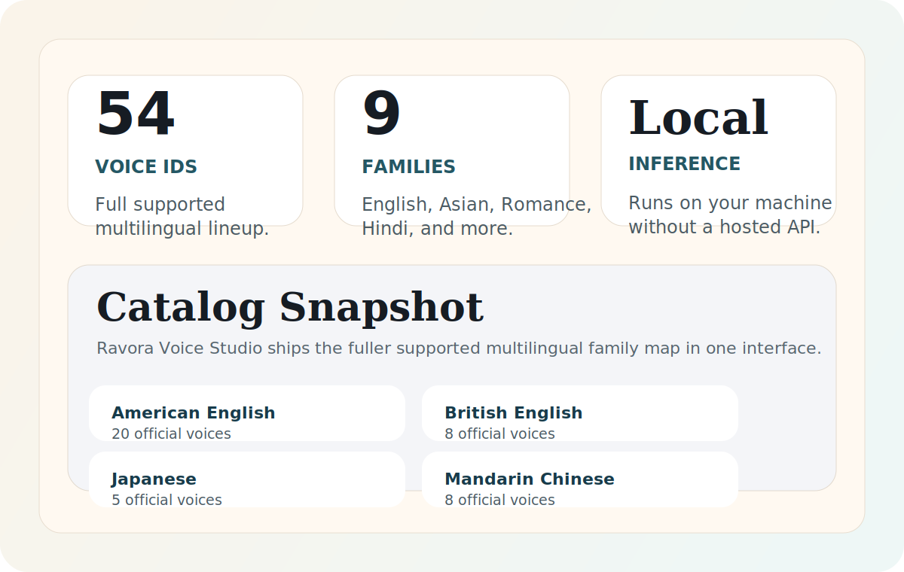

# Ravora Voice Studio

> Local Windows TTS desktop software for buyers who want the fuller Ravora experience with the complete supported catalog and a clean installer-first workflow.

Ravora Voice Studio is a **local Windows text-to-speech (TTS) desktop app** built for users who want the broader Ravora catalog in a ready-to-install package. It runs on your own PC, supports a wider multilingual lineup, and gives you **WAV + JSON export** in a workflow designed for creators, developers, and power users.

**Keywords:** Windows TTS, local text to speech, multilingual TTS, desktop TTS, local AI, WAV export, installer-based TTS, no subscription.

## Buy Ravora Voice Studio
- Direct checkout: [Ravora Voice Studio](https://halbytelabs.lemonsqueezy.com/checkout/buy/ddc7be1c-ddfa-4111-a8e8-89d265375cba)
- Storefront: [Halbyte Labs](https://halbytelabs.lemonsqueezy.com/)
- Need the smaller edition: [Ravora Lite](https://halbytelabs.lemonsqueezy.com/checkout/buy/345a4cbd-c523-44bf-8403-784f1411d95f)

## Why users choose Ravora Voice Studio
- Local Windows desktop app
- Ready-to-install package
- 54 official voice IDs
- 9 voice families
- Broader multilingual catalog
- WAV + JSON export
- Installer-based setup
- No subscription required
- Best fit for buyers who want the fuller Ravora package

## What you get
- Windows installer package
- Full Ravora desktop interface
- Local speech generation on your own machine
- Audio preview plus metadata export
- Broader voice coverage for Windows creators and power users

## Best for
- Creators who want the wider voice catalog
- Power users who want the fuller multilingual edition
- Developers and AI hobbyists who prefer local desktop software
- Buyers who want a Windows TTS package without hosted APIs or monthly plans

## Ravora Voice Studio vs Lite
| Edition | Best fit | Catalog | Price |
| --- | --- | --- | --- |
| **Ravora Voice Studio** | Broader catalog, fuller desktop package | 54 voice IDs / 9 families | [EUR 14.99](https://halbytelabs.lemonsqueezy.com/checkout/buy/ddc7be1c-ddfa-4111-a8e8-89d265375cba) |
| **Ravora Lite** | Faster install, smaller multilingual workflow | 41 voice IDs / 7 families | [EUR 9.99](https://halbytelabs.lemonsqueezy.com/checkout/buy/345a4cbd-c523-44bf-8403-784f1411d95f) |

## Quick requirements
- Windows 10 or 11, 64-bit
- Modern 4-core CPU minimum
- 8 GB RAM minimum
- 6 GB free disk space minimum
- Internet required on first launch for model download

## Brand
Built by **Halbyte Labs**.

If you want the direct Windows build, use the checkout link above or browse the full store:
[https://halbytelabs.lemonsqueezy.com/](https://halbytelabs.lemonsqueezy.com/)
